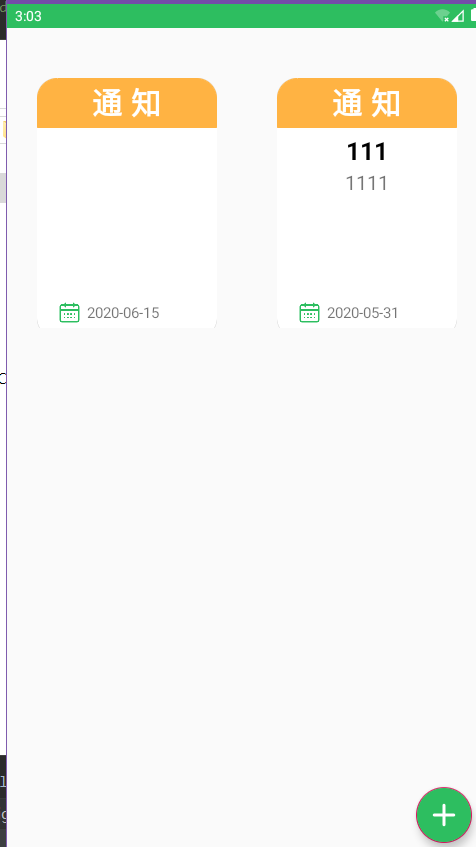
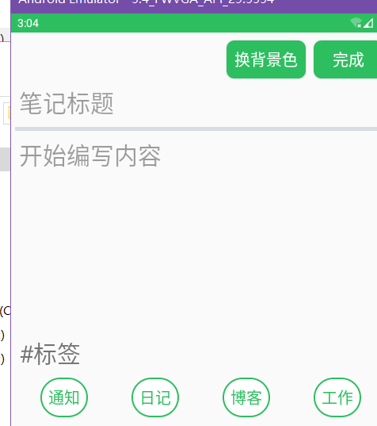
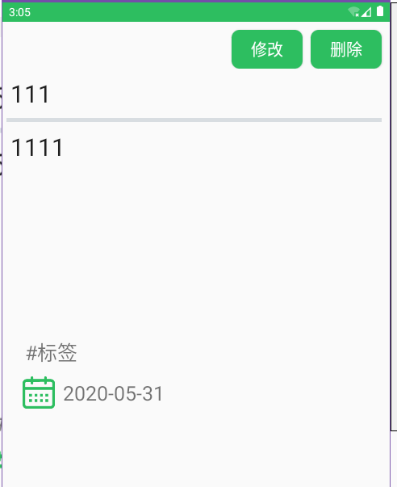

## 一、功能

### 1.时间戳显示

### 结果




### 2.根据标题查询








## 二、有关代码

### 1.时间戳显示


在xml中添加用于显示时间戳的TextView

```
<TextView
      android:id="@+id/date"
      android:layout_width="wrap_content"
      android:layout_height="25dp"
      android:textSize="15sp"
      android:layout_marginLeft="5dp"
      android:gravity="center_vertical"
      />
```


使用 SimpleDateFormat 类的 format(date) 方法来格式化时间

```
public void onClick(View v) {
        switch (v.getId()) {
            case R.id.complete:
			
                String title = titleText.getText().toString();
                String content = contentText.getText().toString();
                SimpleDateFormat simpleDateFormat = new SimpleDateFormat("yyyy-MM-dd");
                Date currentDate = new Date(System.currentTimeMillis());
                String date = simpleDateFormat.format(currentDate);
				
                String insertSql="insert into nodepad(title,content,date,type)values(?,?,?,?)";

                db.execSQL(insertSql,new String[]{title,content,date,type+""});
                Toast.makeText(this, "增添成功", Toast.LENGTH_LONG).show();
                startActivity(new Intent(this, MainActivity.class));
                break;
            case R.id.change_background:
                showDialog();
                break;

        }
    }
```


### 2.根据标题查询


编写查询界面xml

```
<?xml version="1.0" encoding="utf-8"?>
<LinearLayout xmlns:android="http://schemas.android.com/apk/res/android"
    android:layout_width="match_parent"
    android:layout_height="match_parent"
    android:gravity="center_horizontal"
    android:orientation="vertical">

    <LinearLayout
        android:layout_width="match_parent"
        android:layout_height="wrap_content"
        android:layout_marginTop="50dp"
        android:gravity="center"
        android:orientation="horizontal">

        <ImageView
            android:layout_width="60dp"
            android:layout_height="60dp"
            android:src="@drawable/sreach" />

        <EditText
            android:layout_marginLeft="10dp"
            android:id="@+id/sreacch"
            android:layout_width="250dp"
            android:layout_height="60dp"
            android:hint="笔记标题"
            android:textSize="30sp"/>

    </LinearLayout>

    <Button
        android:id="@+id/button_sreach"
        android:layout_marginTop="20dp"
        android:layout_width="200dp"
        android:layout_height="wrap_content"
        android:background="@drawable/button"
        android:text="查询"
        android:textSize="20sp"
        android:textScaleX="1"
        android:textColor="#ffffff"/>

</LinearLayout>

```


编写查询结果xml

```
<?xml version="1.0" encoding="utf-8"?>
<LinearLayout xmlns:android="http://schemas.android.com/apk/res/android"
    android:layout_width="match_parent"
    android:layout_height="match_parent"
    android:orientation="vertical">

    <RelativeLayout
        android:layout_width="match_parent"
        android:layout_height="wrap_content"
        android:gravity="center_vertical">

        <Button
            android:id="@+id/change_node"
            android:layout_width="wrap_content"
            android:layout_height="wrap_content"
            android:layout_toLeftOf="@+id/delete_node"
            android:layout_marginTop="10dp"
            android:layout_marginRight="10dp"
            android:background="@drawable/button"
            android:text="修改"
            android:textSize="20sp"
            android:textScaleX="1"
            android:textColor="#ffffff"/>

        <Button
            android:id="@+id/delete_node"
            android:layout_marginTop="10dp"
            android:layout_width="wrap_content"
            android:layout_height="wrap_content"
            android:layout_alignParentRight="true"
            android:layout_marginRight="10dp"
            android:background="@drawable/button"
            android:text="删除"
            android:textSize="20sp"
            android:textScaleX="1"
            android:textColor="#ffffff"/>

    </RelativeLayout>

    <EditText
        android:id="@+id/detail_node_title"
        android:layout_marginLeft="10dp"
        android:layout_marginTop="10dp"
        android:layout_width="match_parent"
        android:layout_height="wrap_content"
        android:background="@null"
        android:hint="笔记标题"
        android:textSize="30sp"/>

    <View
        android:layout_width="match_parent"
        android:layout_height="5dp"
        android:background="#D8DDE1"
        android:layout_marginTop="10dp"
        android:layout_marginRight="10dp"
        android:layout_marginLeft="5dp"
        ></View>


    <EditText
        android:id="@+id/detail_node_content"
        android:layout_marginLeft="10dp"
        android:layout_marginRight="10dp"
        android:layout_marginTop="10dp"
        android:layout_width="match_parent"
        android:layout_height="250dp"
        android:background="@null"
        android:hint="开始编写内容"
        android:gravity="top"
        android:textSize="30sp"/>

    <TextView
        android:id="@+id/detail_type"
        android:layout_width="100dp"
        android:layout_height="50dp"
        android:gravity="center"
        android:layout_marginRight="10dp"
        android:textSize="25sp"
        android:text="#标签"
        android:layout_marginLeft="10dp"/>

    <LinearLayout
        android:layout_width="match_parent"
        android:layout_height="wrap_content"
        android:layout_marginTop="0dp"
        android:layout_marginLeft="10dp"
        android:layout_marginRight="10dp"
        android:gravity="center_vertical"
        android:orientation="horizontal">

        <ImageView
            android:layout_width="50dp"
            android:layout_height="50dp"
            android:layout_marginLeft="10dp"
            android:src="@drawable/date_img"/>

        <TextView
        android:id="@+id/detail_date"
        android:layout_width="wrap_content"
        android:layout_height="50dp"
        android:textSize="25sp"
        android:layout_marginLeft="5dp"
        android:gravity="center_vertical"
        >

    </LinearLayout>
</LinearLayout>
```


显示笔记详情

```
protected void onCreate(Bundle savedInstanceState) {
        super.onCreate(savedInstanceState);
        setContentView(R.layout.layout_detail);

        Intent intent = getIntent();
        Bundle bundle = intent.getExtras();
        node=new Node();
        node.setNodeTitle(bundle.getString("title"));
        node.setNodeContent(bundle.getString("content"));
        node.setNodeClass(bundle.getInt("type", 0));
        node.setNodeID(bundle.getInt("id", 0));
        node.setSaveDate(bundle.getString("date"));

        init();
        setType();

    }
    
    protected void onNewIntent(Intent intent) {
        super.onNewIntent(intent);
        setIntent(intent);//设置新的intent
    }


    public void init(){
        change = findViewById(R.id.change_node);
        delete = findViewById(R.id.delete_node);
        titleText = findViewById(R.id.detail_node_title);
        contentText = findViewById(R.id.detail_node_content);
        typeText = findViewById(R.id.detail_type);
        dataText = findViewById(R.id.detail_date);

        change.setOnClickListener(this);
        delete.setOnClickListener(this);

        titleText.setText(node.getNodeTitle());
        contentText.setText(node.getNodeContent());
        dataText.setText(node.getSaveDate());

        this.db = DataBaseUtil.returnDataBase(this);
    }
```


