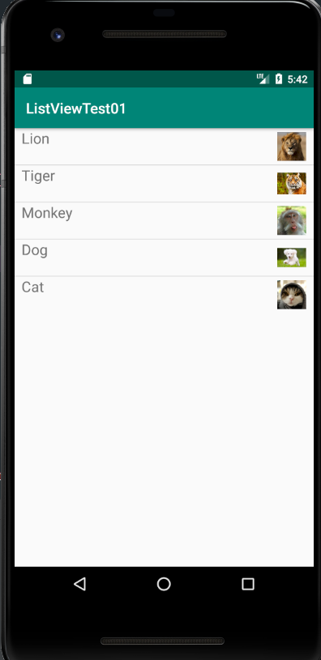
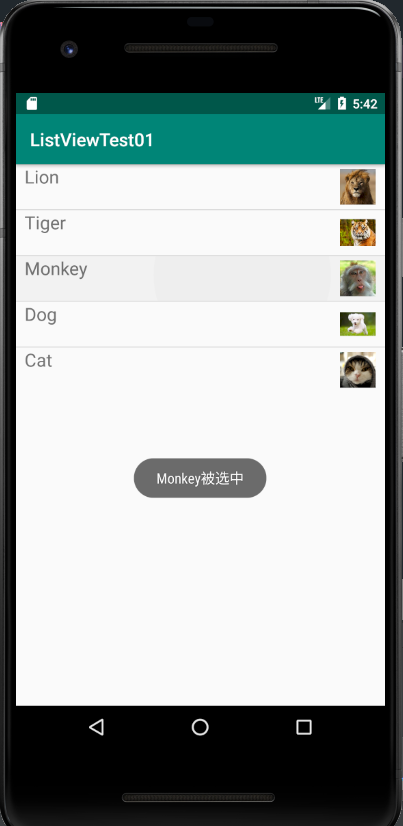
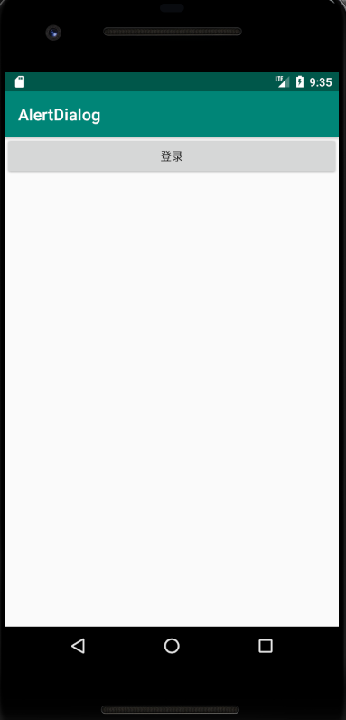
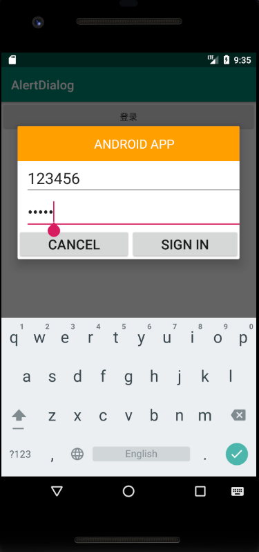
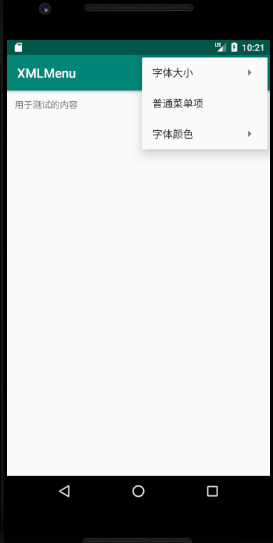
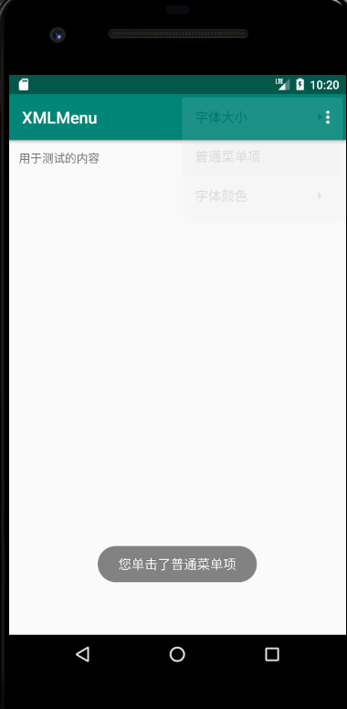
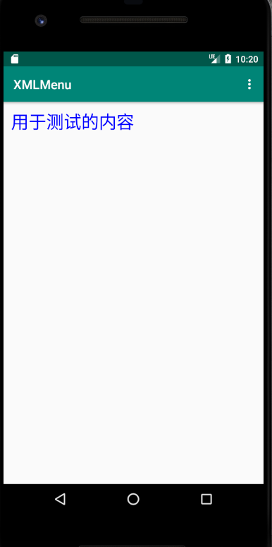
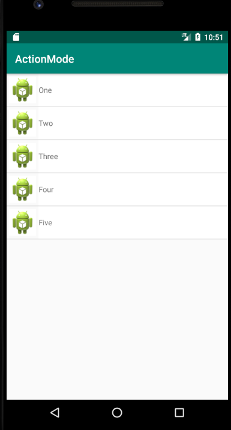
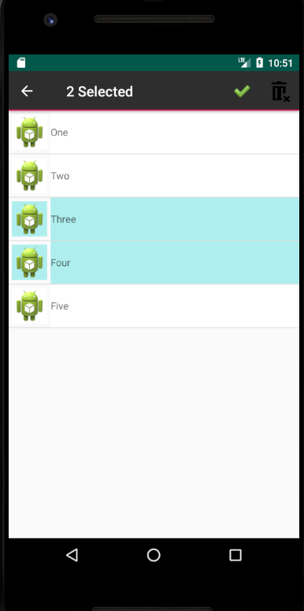

# 实验三  Android UI组件

### Android ListView的用法

##### 使用Toast显示选中的列表项信息

### 创建自定义布局的AlertDialog

点击登录弹出对话框

### 使用XML定义菜单

分别有字体大小，普通菜单项，字体颜色三种选项

点击普通菜单项弹出Toast

通过字体大小和颜色菜单来改变字体

### 创建上下文操作模式(ActionMode)的上下文菜单

长按选中

